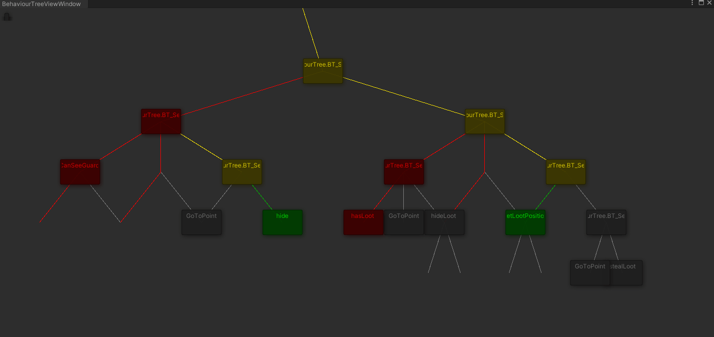
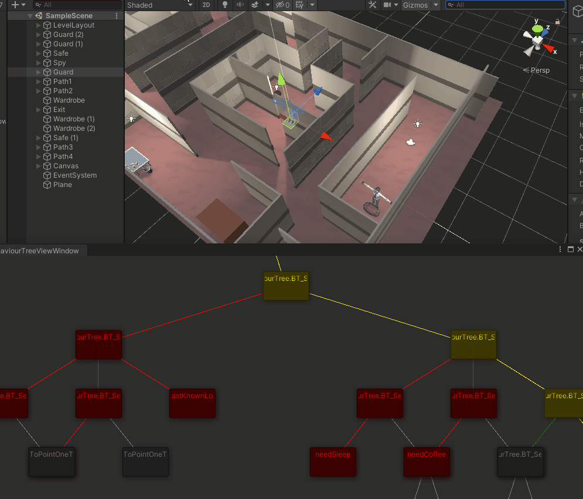

# AI-Guard-Spy
An example of behavior trees implemented in AI to drive decisions of a guard.

### A view of the BT_Tree viewer tool

### A view of the BT_Tree in action, showing the active state using the viewer tool

